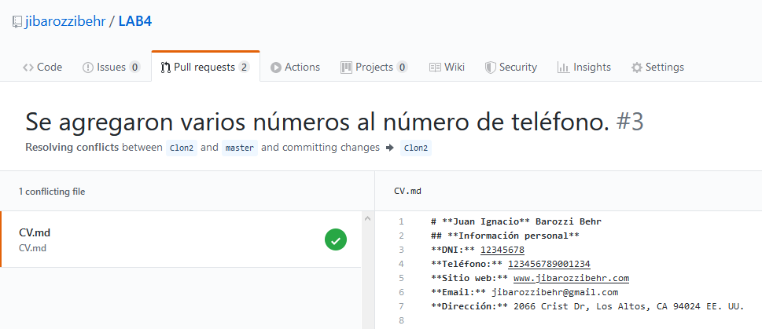

# Trabajo Práctico N°1
El repositorio del trabajo se puede encontrar [acá](http://www.github.com/jibarozzibehr/LAB4).  

## *Mergeando* códigos con conflicto

- Al intentar _mergear_ dos ramas que están en conflicto, recibimos el siguiente mensaje:  
  
- Y al crear la _pull request_ obtenemos:  
  
- Entonces podemos optar por abrir el editor, y la herramienta nos va a mostrar dónde está el conflicto:  
  
- Una vez que resolvimos el conflicto, se obtiene lo siguiente:  
  

---

## ¿Qué son las versiones LOCAL, BASE y REMOTE?
La versión **LOCAL** de un desarrollo es la que mantenemos, como su nombre lo dice, _localmente_ en nuestro equipo.

La versión **REMOTE**, en contraste de la LOCAL, es la que se encuentra en un repositorio en común, donde todos los miembros del equipo de desarrollo pueden compartir los cambios que hayan realizado.

La versión **BASE**.  
*(En desarrollo)*